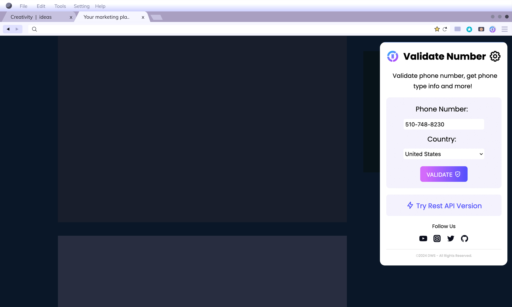

# Phone Number Validation 📱

Validate phone numbers effortlessly with our Phone Number Validation browser extension. This extension provides a seamless way to verify phone numbers, check carriers, and obtain essential details like location and phone type.

## Key Features 🚀

- **Phone Number Validation**: Input any phone number and click "Validate" to instantly verify its authenticity.
- **Carrier Information**: Discover the carrier associated with the phone number.
- **Location Details**: Get insights into the location of the phone number.
- **Phone Type Identification**: Identify whether the phone number is a landline or mobile.

## Demo 🎥

Watch the extension in action on [YouTube](https://www.youtube.com/embed/zaeaWCM75bA?si=xTpqcgNCqtYtUWHO).

## Installation 🛠️

- Awaiting approvals ⏳

## Usage 📝

1. Install the extension in your preferred browser.
2. Open the extension popup and enter the phone number you want to validate.
3. Click "Validate" to receive detailed information about the phone number.

## Contributing 🤝

We welcome contributions! If you have ideas for new features, bug fixes, or improvements, please open an issue or submit a pull request.

## Discover the API! 🌐

Enhance your projects with our robust Phone Number Verification API. Explore various endpoints and functionalities to elevate your applications. [Check it out here](https://github.com/dakidarts/checky-verify-phone-number-api).

## License 📜

"Phone Number Validation" is licensed under the [MIT License](https://github.com/dakidarts/phone-number-validation-extension?tab=MIT-1-ov-file). See the [LICENSE](https://github.com/dakidarts/phone-number-validation-extension?tab=MIT-1-ov-file) file for details.

---

For more information, visit [dakidarts.com](https://dakidarts.com) | Twitter: [@dakidarts](https://twitter.com/dakidarts) | LinkedIn: [company/dakidarts](https://linkedin.com/company/dakidarts).
